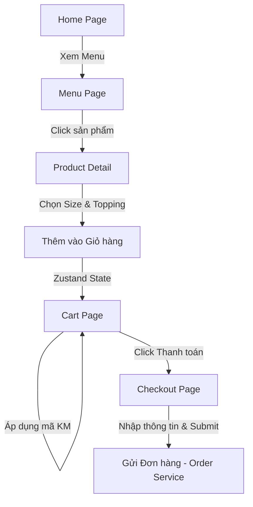

# Software Requirements Specification (SRS) - Lowlands Coffee

Hệ thống Frontend cho Website thương mại điện tử bán cà phê trực tuyến **Lowlands Coffee**.

## 1. Giới thiệu (Introduction)
Dự án **Lowlands Coffee** xây dựng một nền tảng web bán cà phê hiện đại, lấy cảm hứng từ các chuỗi lớn như Highlands Coffee và Starbucks nhưng mang đậm bản sắc vùng miền Việt Nam (Vùng đất thấp, văn hóa kết nối). Hệ thống chú trọng vào trải nghiệm mượt mà, hiệu năng cao, tối ưu SEO, hỗ trợ đa ngôn ngữ (tiếng Việt & tiếng Anh), và kiến trúc tách biệt hoàn toàn giữa giao diện người dùng và API Backend.

## 2. Giao diện & Các Trang (Pages & Routes)

### 2.1 Trang chủ (Home Page - `/`)
- **Hero Banner**: Slideshow banner động quảng bá các sản phẩm cà phê và chương trình khuyến mãi đặc sắc.
- **Featured Coffee**: Trình bày danh sách sản phẩm nổi bật theo danh mục (Cà phê phin, Trà, Phindi, Freeze).
- **Category Showcase**: Lối tắt trực quan đi tới các danh mục sản phẩm của cửa hàng.
- **Promotion Section**: Hiển thị các mã giảm giá (Promotions) đang diễn ra.
- **Store Locator**: Bộ tìm kiếm cửa hàng gần nhất (theo tỉnh thành, địa chỉ).
- **About Brand**: Giới thiệu câu chuyện thương hiệu Lowlands Coffee.

### 2.2 Trang Thực đơn (Menu Page - `/menu`)
- **Danh sách sản phẩm**: Hiển thị lưới sản phẩm phân trang hoặc lazy loading.
- **Bộ lọc (Filter)**: Lọc theo khoảng giá, theo danh mục sản phẩm (`categories`).
- **Thanh tìm kiếm**: Tìm kiếm sản phẩm theo tên.
- **Trạng thái**: Khi sản phẩm chưa tải xong, sử dụng skeleton loader.

### 2.3 Trang Chi tiết Sản phẩm (Product Detail Page - `/menu/[id]`)
- **Hình ảnh & Mô tả**: Hiển thị ảnh chất lượng cao và thông tin chi tiết sản phẩm.
- **Chọn Size**: Lựa chọn kích cỡ (S, M, L) tương ứng với các biến thể sản phẩm (`product_variants` từ DB). Mỗi size sẽ thay đổi giá hiển thị.
- **Chọn Topping**: Chọn danh sách topping đi kèm sản phẩm (ví dụ: Thạch cà phê, Trân châu, Kem phô mai) lấy dữ liệu từ `product_toppings` và `toppings`.
- **Số lượng (Quantity)**: Nút tăng/giảm số lượng sản phẩm cần mua.
- **Nút Thêm vào giỏ hàng**: Thêm sản phẩm kèm tùy chỉnh size, topping vào giỏ hàng cục bộ (Zustand) và đồng bộ với API.

### 2.4 Trang Giỏ hàng (Cart Page - `/cart`)
- **Danh sách sản phẩm trong giỏ**: Chi tiết từng item (tên, size, danh sách topping đã chọn, ghi chú `note`).
- **Thay đổi số lượng & Xóa**: Cho phép tăng/giảm số lượng hoặc xóa item ngay tại giỏ hàng.
- **Áp dụng Mã Khuyến mãi**: Ô nhập mã giảm giá (`promotions.code`) và tính toán số tiền được giảm.
- **Tóm tắt đơn hàng**: Tính toán Subtotal, Discount, và Total Amount.

### 2.5 Trang Thanh toán (Checkout Page - `/checkout`)
- **Thông tin giao hàng**:
  - Tên người nhận (`receiver_name`)
  - Số điện thoại (`receiver_phone`)
  - Địa chỉ nhận hàng (`delivery_address`)
  - Ghi chú đơn hàng (`note`)
- **Phương thức thanh toán (`payment_method`)**: Hỗ trợ tiền mặt (COD), Chuyển khoản, Ví điện tử.
- **Xác nhận đơn hàng**: Hiển thị tóm tắt danh sách sản phẩm và tổng tiền, nút đặt hàng gửi request lên `order.service.ts`.

### 2.6 Trang Xác thực & Người dùng (Authentication UI)
- **Đăng nhập (`/login`)**: Form đăng nhập bằng Email/Số điện thoại và Mật khẩu. Có validation lỗi định dạng.
- **Đăng ký (`/register`)**: Form đăng ký thông tin cá nhân (Họ tên, Email, Số điện thoại, Mật khẩu).
- **Trang cá nhân (`/profile`)**: Hiển thị thông tin người dùng, lịch sử đơn hàng (`orders`) và danh sách địa chỉ giao hàng (`customer_addresses`).

### 2.7 Giao diện Admin Placeholder (`/admin`)
- Chỉ dựng cấu trúc thư mục chứa các UI cơ bản cho quản trị viên (Quản lý sản phẩm, đơn hàng). Không có logic nghiệp vụ.

## 3. Quy trình Nghiệp vụ (Key Workflows)

## 4. Các Ràng buộc Phi chức năng (Non-Functional Requirements)
- **Đa ngôn ngữ (i18n)**: Tất cả UI text phải sử dụng hệ thống dịch `next-intl` (hỗ trợ Tiếng Việt làm mặc định và Tiếng Anh).
- **Responsive**: Giao diện tối ưu hóa cho Mobile First, hiển thị tốt trên Desktop và Tablet.
- **Hiệu năng**:
  - Sử dụng component `next/image` cho mọi hình ảnh sản phẩm.
  - Sử dụng Server Component theo mặc định, chỉ dùng Client Component cho các thành phần tương tác (Form, Button, Slider, Cart Store).
- **SEO**: Sử dụng `generateMetadata` lấy tiêu đề và mô tả từ file dịch i18n của từng trang.
